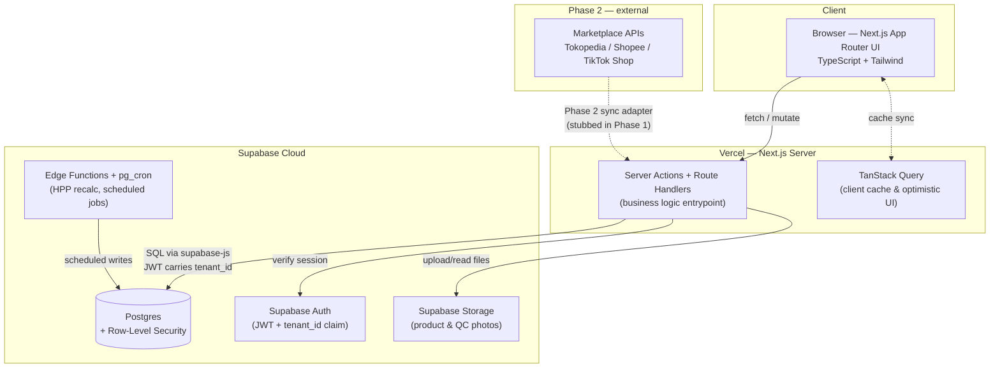
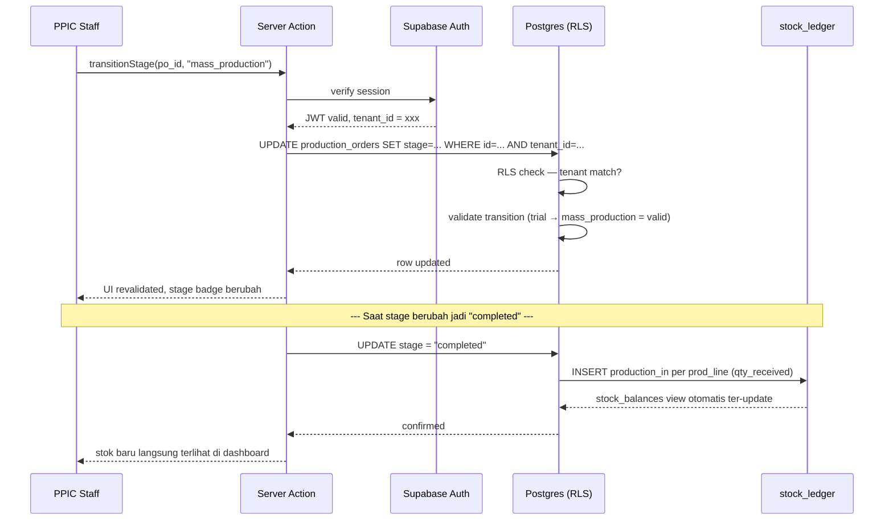

# ADR — Vobia Platform: Stack & Architecture

**Status:** Accepted
**Deciders:** GenDev Studio (Nje) · Vobia
**Related doc:** `vobia_erp_phase1_prd.md`

Perluasan dari bagian **Implementation Decisions** di PRD Phase 1 — dari keputusan besar (kenapa full custom) turun ke tiap pilihan teknis granular, dengan alternatif yang dipertimbangkan, bukan cuma hasil akhirnya.

---

## 1. Context

Vobia butuh sistem ops (produksi, inventory, omnichannel, costing) yang sekarang berjalan manual lewat spreadsheet & WhatsApp. Tiga arah build dipertimbangkan di awal:

- **(A)** Extend ERPNext/Odoo
- **(B)** Compose omnichannel SaaS (Jubelio/Ginee) + custom glue
- **(C)** Full custom di atas Supabase + Next.js

**Opsi C dipilih.** Prioritasnya kontrol penuh atas data model & kemungkinan produktisasi ke brand fashion lain (Vobia sebagai design partner / client zero), bukan cuma menyelesaikan masalah Vobia secepat mungkin.

Trade-off yang diterima: effort lebih besar karena membangun ulang hal-hal yang ERP jadi kasih gratis (permission, state machine, reporting dasar).

---

## 2. High-level architecture



Dua layer hosting: **Vercel** (app + server logic) dan **Supabase Cloud** (data + auth + storage). Tidak ada API server terpisah.

---

## 3. Stack summary

| Layer | Technology | Peran |
|---|---|---|
| Frontend | `Next.js 14+ (App Router)` · TypeScript · Tailwind CSS | UI, routing, form handling, admin dashboard |
| Data fetching / state | `TanStack Query` | Client-side cache, optimistic update (mis. saat ubah stage Production Order) |
| Backend / API | `Next.js Server Actions` + Route Handlers | Business logic entrypoint — tidak ada server Express/Fastify terpisah |
| Database | `Supabase Postgres` | Single source of truth — 12 entity dari PRD, relational by design |
| Auth | `Supabase Auth` | Session + JWT dengan custom claim `tenant_id`, langsung dipakai RLS |
| File storage | `Supabase Storage` | Foto produk, foto QC reject, dokumen PO |
| Background jobs | `Supabase Edge Functions` + `pg_cron` | Recalculate HPP, integrity check ledger, (Phase 2) polling marketplace API |
| Type safety | `Supabase CLI codegen` | TypeScript types digenerate langsung dari schema Postgres — no manual drift |
| Hosting | `Vercel` + `Supabase Cloud` | Managed, zero-ops untuk MVP; bisa migrasi self-host Supabase kalau perlu nanti |
| Testing | `Vitest` · `Playwright` · `pgTAP` | Unit (logic murni) · E2E (flow kritis) · RLS/constraint verification |
| CI/CD | `GitHub Actions` | Preview deploy per PR (Vercel) + cek migration Supabase sebelum merge |

---

## 4. Keputusan stack granular

### 4.1 Backend layer: dimana business logic hidup?

**Chosen: Next.js Server Actions + Route Handlers**

| Opsi | Assessment |
|---|---|
| ✓ Server Actions / Route Handlers | Colocated dengan frontend, satu deploy target, satu bahasa (TypeScript) dari UI sampai query. Cocok buat tim kecil / 1 developer. |
| ✕ Express/Fastify terpisah | Nambah 1 service buat di-deploy & maintain, butuh CORS setup, tidak ada keuntungan nyata karena tidak ada konsumen API eksternal di Phase 1. |

**Kenapa:** Tidak ada kebutuhan API publik di Phase 1 (belum ada integrasi marketplace real-time). Server terpisah baru masuk akal begitu ada konsumen API eksternal (mis. Phase 2 saat marketplace webhook masuk) — bisa ditambah sebagai Route Handler tanpa restrukturisasi.

### 4.2 Data access: ORM atau query langsung?

**Chosen: Supabase client + generated types (no ORM dulu)**

| Opsi | Assessment |
|---|---|
| ✓ supabase-js + codegen types | Query langsung ke Postgres, RLS sudah jadi lapisan keamanan — ORM tidak menambah proteksi, cuma menambah abstraksi. Types digenerate otomatis dari schema, tidak pernah out-of-sync. |
| ✕ Prisma / Drizzle | Bagus untuk query kompleks & migration DX, tapi nambah layer belajar + kemungkinan konflik dengan RLS policy (ORM sering bypass RLS kalau pakai service role). Ditunda sampai query benar-benar butuh abstraksi lebih. |

**Kenapa:** Skema 12 entity ini masih flat & predictable (bukan graph query kompleks).
**Revisit trigger:** begitu ada laporan lintas-entity yang butuh query agregat berat (mis. dashboard analytics multi-tenant), pertimbangkan Drizzle untuk query builder type-safe di layer read-only.

### 4.3 Auth & multi-tenancy enforcement

**Chosen: Supabase Auth + RLS (bukan filter di application code)**

| Opsi | Assessment |
|---|---|
| ✓ RLS di database | `tenant_id` masuk JWT custom claim saat login, tiap query otomatis difilter di level Postgres. Bug di application code tidak bisa bocorin data tenant lain — proteksi ada di lapisan yang tidak bisa dilewati. |
| ✕ Filter tenant_id manual di tiap query | Satu baris kode yang lupa ditambahin `WHERE tenant_id = ...` = data bocor antar tenant. Terlalu berisiko untuk platform yang niatnya multi-tenant dari awal. |

**Kenapa:** Ini keputusan yang paling langsung mendukung tujuan produktisasi — begitu RLS jadi kebiasaan sejak entity pertama, menambah tenant baru = 0 baris kode aplikasi yang berubah.

```sql
-- pola RLS yang diulang di semua tabel
alter table skus enable row level security;

create policy tenant_isolation on skus
  using (tenant_id = current_setting('request.jwt.claims', true)::json->>'tenant_id');
```

### 4.4 Background & scheduled logic

**Chosen: Supabase Edge Functions + pg_cron**

| Opsi | Assessment |
|---|---|
| ✓ Edge Functions + pg_cron | Jalan dekat dengan data (low latency ke Postgres), tidak perlu infra tambahan. Cocok untuk job seperti recalculate HPP setiap ada cost_entry baru. |
| ✕ Vercel Cron / external queue (Inngest, dll) | Overkill untuk volume Phase 1. Baru relevan di Phase 2 kalau polling banyak marketplace API sekaligus dengan retry/backoff kompleks. |

**Revisit trigger:** begitu Phase 2 mulai polling 3+ marketplace API dengan kebutuhan retry & rate-limit handling yang rumit, evaluasi ulang — mungkin butuh queue dedicated.

---

## 5. Modul PRD → lapisan stack

| Modul | Database | Server logic | Catatan |
|---|---|---|---|
| **Product Spine** | `styles · colorways · skus` | Server Action: `createSku`, validasi size_curve | size_curve tersimpan jsonb, expand ke SKU saat create |
| **Stock Ledger** | `stock_ledger` + view `stock_balances` | `recordMovement()`, `getBalance()` | Deep module — satu-satunya write path ke stok |
| **Production & Vendor** | `vendors · production_orders · prod_lines` | `transitionStage()` — Postgres function + app-layer guard | State machine divalidasi di 2 lapis: DB constraint + Server Action |
| **Channel & Order** | `channels · orders · order_lines` | Route Handler stub untuk sync adapter (Phase 2) | Phase 1: entry manual/CSV import |
| **Returns** | `returns` | Trigger Postgres → auto-insert ke `stock_ledger` saat `restock=true` | Logic restock di level DB trigger, bukan aplikasi |
| **Costing** | `cost_entries` (FK ke production_orders) | `recalculateSkuHpp()` dipanggil dari Edge Function | PPV = generated column, tidak dihitung di aplikasi |
| **Tenant & Access** | `tenant_id` di semua tabel + RLS policy | Supabase Auth JWT claim | Foundation — bukan modul UI berdiri sendiri |

---

## 6. Data flow — contoh konkret

Contoh: PPIC pindahin stage Production Order — validasi jalan di 2 lapis, ledger ter-update otomatis tanpa input manual terpisah.



---

## 7. Skala, biaya, dan yang perlu direvisit

> ⚠ **Diputuskan sekarang, sengaja ditinjau ulang nanti**

- **RLS-only multi-tenancy** cukup untuk puluhan tenant. Kalau platform tumbuh ke ratusan brand dengan volume ledger tinggi, evaluasi ulang: tetap row-level, atau pindah ke schema-per-tenant untuk isolasi performa.
- **Tanpa ORM** aman selama query masih flat. Begitu butuh dashboard analitik lintas-tenant yang kompleks, pertimbangkan Drizzle di layer read-only saja (bukan ganti seluruh data access).
- **Edge Functions + pg_cron** cukup untuk job terjadwal sederhana. Begitu Phase 2 sync ke 3+ marketplace API dengan rate-limit & retry kompleks, pertimbangkan queue dedicated (mis. Inngest atau Supabase Queues begitu stabil).
- **Vercel + Supabase Cloud** optimal untuk kecepatan MVP dan biaya rendah di fase awal (< Rp 1 juta/bulan estimasi Phase 1). Kalau nanti volume tenant besar & butuh kontrol infra penuh (compliance, data residency), self-hosted Supabase jadi opsi — schema tetap portable karena semuanya Postgres standar.

---

## 8. Action items — urutan build

1. **Setup project** — inisiasi repo Next.js (App Router, TypeScript, Tailwind), provision Supabase project, generate types pipeline.
2. **Foundation dulu** — `tenant_id` + RLS policy pattern di-set up sebelum entity apapun dibuat, supaya jadi kebiasaan sejak baris kode pertama.
3. **Product Spine** — `styles → colorways → skus`, termasuk validasi size_curve.
4. **Stock Ledger** — deep module ini dibangun & ditest duluan (isolated), karena semua modul lain bergantung ke sini.
5. **Production & Vendor** — state machine + trigger otomatis ke ledger saat stage = completed.
6. **Costing** — cost_entries + auto-recalculate HPP, generated column PPV.
7. **Channel & Order** — mulai dari entry manual, sync adapter di-stub untuk Phase 2.
8. **Returns** — trigger restock ke ledger.
9. **UI dashboard** dibangun paralel begitu 2–3 modul pertama stabil, bukan nunggu semua backend selesai.

---

*ADR — Vobia Platform Architecture · pelengkap PRD Phase 1 · GenDev Studio × Vobia*
